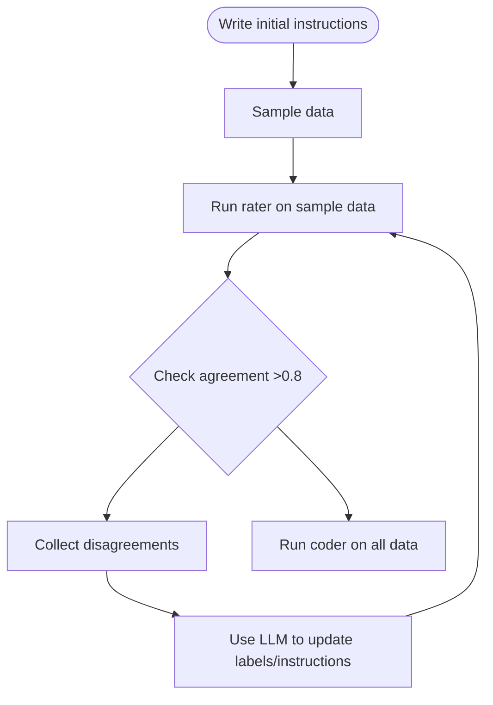

# Automated Grounded Research Environment (AGReE)

LLMs have opened the door of natural language processing using natural language instructions.  This has myriad uses, but one that has proven incredibly powerful is *qualitative coding for grounded research*.  Imagine you're sitting on a pile of qualitative data: user interviews, product reviews, videos of activities, etc.  How do you extract quantitative insights from that data?  You write up instruction for *applying labels* to chunks from the qualitative data, then you can analyze those label quantitatively (thinks like frequency, co-occurance, etc.).  But, are those labels actually meaningful?  The typical way of testing that is to have two different people apply those label (*code* the data), then check the inter-rater agreement with a metric like Cohen's Kappa.  If the kappa is low (<0.8), dig into the disagreements and revise your instructions.  If the kappa is good (>0.8), you're golden.

This project is my attempt to simplify these workflows, using LLMs.  There's a simple format for defining pipelines of data sources, filters, coders, raters and loggers, and utilities for scoring and examining disagrements.

The vision is to make it "easy" to gain insights from huge quantities of qualitative data, by making it easy to develop, test, optimize and run labelling pipelines!

## Example

Given a JSON lines file of snippets from a story, label the events in the snippet as positive, negative or none, and check the Cohen's Kappa for the two.

```python
from coder import Coder, Rater
from persistance import JsonlSource, JsonlSink
from utilities import Progress
from review import cohens_kappa, aggregate_disagreements

# Create two coders for event sentiment in a short story
instructions = """You will be given a snippet of text from a short story.  Please apply one of the below labels to the snippet, based on the explination for the labels.  Use the specified response format."""
labels = [
    ('positive', 'A good event happens to the characters in the story'),
    ('negative', 'A bad event happens to the characters in the story'),
    ('none', 'No events happen, or the events are not positive or negative for the characters in the story')
]
openai_coder = Coder(instructions, labels, model="openai/gpt-4o-mini")
anthropic_coder = Coder(instructions, labels, model="anthropic/claude-haiku-4-5")

# Create a pipeline to load text from a JSON lines file, perform IRA, save results, print progress, and compute the score at the end
pipeline = Rater(openai_coder, anthropic_coder) | Progress() | JsonlSink('output.jsonl')

score = cohens_kappa(pipeline(JsonlSource('input.jsonl')([])), labels)
print(score)
disagreements = aggregate_disagreements(JsonlSource('output.jsonl')([]))
```

In practice, this gives a pretty bad kappa, like 0.5.  This makes sense, as the descriptions are pretty ambiguous; how much is the rater to read between the lines?  That's where `aggregate_disagreements` comes in — it lumps together examples from any disagreed label pairs.  From there, `summarize_disagreements` turns those into a Markdown report, and `propose_revision` passes it to an LLM to suggest updated instructions and label descriptions, allowing us to automate incremental improvements.

```python
from review import summarize_disagreements, propose_revision, pluck_for_rater_disagreement

summary = summarize_disagreements(disagreements, pluck_for_rater_disagreement, instructions, labels)
revision = propose_revision(summary, model="openai/gpt-4o-mini", labels=labels)

new_instructions = revision['instructions']
new_labels = [(l['name'], l['description']) for l in revision['labels']]

# Rerun with revised instructions and labels
pipeline = Rater(Coder(new_instructions, new_labels, model="openai/gpt-4o-mini"),
                 Coder(new_instructions, new_labels, model="anthropic/claude-haiku-4-5")) | Progress() | JsonlSink('output_v2.jsonl')
score2 = cohens_kappa(pipeline(JsonlSource('input.jsonl')([])), new_labels)
```

See `demo.py` for a working end-to-end version of this loop; it's all stochastic, but we often observe the kappa jump from ~0.4 -> >0.8



### Pipeline item format

Every processor in the pipeline outputs items with a consistent shape: `result` holds what the processor produced, and `parent` carries the original input item.  This makes the full chain walkable — you can always trace a coded result back to the raw source.

```python
# Coder output
{'result': 'positive', 'parent': original_text, 'model': ..., 'usage': ..., 'cost': ...}

# Rater output
{'result': True, 'parent': original_text, 'rater1': coder1_output, 'rater2': coder2_output}
```

You can also use a `Transformer` (which returns a *list* of strings per item, e.g. reformatting raw text into "I want…" statements) followed by `Expand` to fan those out into individual items for downstream coding.  In that case, each expanded item is `{'result': individual_string, 'parent': transformer_output}`, so you can always recover the original source text.

## Structure
### processor.py

Core structure of the pipeline.  We have a few classes:
- `Processor`: takes a per-item processing function, when called with an iterable will return a generator applying that function to each item
- `Pipeline`: a processor that abuses the `__or__` operator to allow pipe-chaining
- `Filter`: a processor that takes a per-item filter function; skips the item if the filter is false-y
- `Nest`: takes a sub-pipeline; runs each item through it (e.g. for side effects like saving), then yields the original item — useful for forking and filtering
- `Expand`: takes a key (default `result`); for each item, yields one `{result, parent}` dict per element in `item[key]` — used to fan out `Transformer` output

### persistance.py

Pipeline elements for loading/saving data.
- `JsonlSource`: loads a JSON lines file; when called, ignores the argument and iterates over each line in the JSONL file.
- `JsonlSink`: takes a JSON lines file; saves each item to a new line in the file, and returns the item.  reset flag will reset the file at initialization.

### utilities.py

Other pipeline utilities.
- `Progress`: show progress through the pipeline in the console

### coder.py

The bulk of the logic for coding.
- `Coder`: given instructions and labels (list of `(label name, label description)`) pairs and the litellm-compatible model ID, create a Processor that will label each item passed in.  Returns `{result, parent, usage, cost, model, instructions}`.  Accepts an optional `getter` to extract text from structured items (e.g. `getter=lambda x: x['result']` when chaining after `Expand`)
- `Transformer`: like `Coder`, but instead of a single label returns a list of strings (e.g. for reformatting).  Pair with `Expand` to fan out the results
- `Rater`: takes two coders, and an optional evaluation function (e.g. if we're doing ordinal coding and want some "dead zone"), and runs each item through both coders, returning `{result: agreement_bool, parent, rater1, rater2}`
- `Disagreement`: basic filter for ratings that disagreed in the pipeline

### review.py

Scoring and iterative improvement.
- `cohens_kappa`: takes a bunch of ratings and the labels and computes the Cohen's Kappa; generally, >0.8 means we did well!
- `aggregate_disagreements`: aggregates the label pairs and `n` examples of each type of disagreement, so we can understand the errors and update the label descriptions/instructions
- `summarize_disagreements`: turns the output of `aggregate_disagreements` into a Markdown report, given a `pluck` function to extract display text from the parent item and the original instructions/labels
- `propose_revision`: passes a disagreement summary to an LLM and returns revised instructions and (optionally) label descriptions as structured output
- `pluck_for_rater_disagreement`: convenience pluck for the direct-coding case (rater input is the raw coded item)
- `pluck_for_transform_review`: convenience pluck for the transformer case (shows the original input and the specific transformed output that was rated)

## To Do
- Cost mgmt?
- Clean up jsonlsource call
- Caching/resuming
- error handling!!
